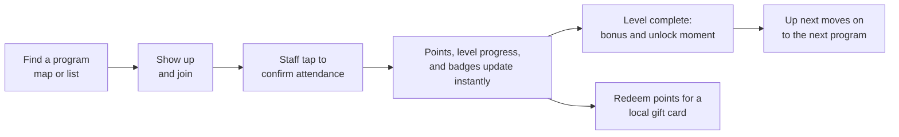

<div align="center">

# Tap In 313

### Your next step starts here.

A rewards app that gets Detroit students into after-school programs, and shows them what to do next.


**[Try the interactive demo](https://daniedeveloper.com)** &nbsp;·&nbsp; [What it does](#what-it-does) &nbsp;·&nbsp; [The 3-minute story](#the-3-minute-story) &nbsp;·&nbsp; [Run it](#run-it)

</div>

> **Tap In 313 is an independent project. It is not an official City of Detroit app.** The 313 is Detroit's area code. The name also matches the core idea: staff *tap* to confirm a student's attendance.

---

## Why it exists

The City of Detroit is investing **$2.2 million** to expand GOAL Line Detroit after-school programming, with **seven new sites** added to 33 existing locations and partners for a total of **40**, and nearly 60 programs and activities. That opens a lot of doors.

A student still has to find a program, show up, and see how it connects to the next one. **Tap In 313 is built for that gap: participation.** It gives students a clear path so programs stop feeling disjointed, and a reason to keep coming back.

We complement GOAL Line Detroit. We do not compete with it, and we do not claim a partnership with it.

**Audience:** students in grades 6 to 8, with a parent or guardian involved.

## What it does



### For students

| | |
|---|---|
| **Programs** | Browse on a map or in a list. Each program shows its site, venue type, schedule, grades, address, points earned, and a "Free ride from your school" tag. Join with one tap. |
| **"Your next step starts here"** | An *Up next* card at the top of the Programs tab always answers "what's next?" |
| **Interest tracks** | Four tracks, three levels each: **Explore, Build, Launch**. Each level is one program and two sessions. |
| **My path** | See every track, level progress like "1 of 2 sessions," what unlocks next, and switch tracks any time without losing progress. |
| **Unlock moments** | Level complete, then track complete, then badges, always in that order. Finishing a level pays a one-time bonus. |
| **Profile** | Avatar, points balance, badges, and an activity history that reads "Checked in by staff at [time]." |
| **Rewards** | A catalog grouped by local merchant. Redeeming deducts points and shows a digital gift card code. |

### For staff

Pick a program, see its roster, and tap to confirm each student who showed up. Confirming awards the program's points, and the student's app updates right away. There is also an at-a-glance dashboard and an iPad layout.

### The four tracks

| Track | Explore (+25) | Build (+40) | Launch (+60) |
|---|---|---|---|
| **Tech Builder** | Robotics | Coding and Tech Club | AI Coding |
| **Creator** | Art Club | Music Studio: Music Creation | Podcasting |
| **Maker and Entrepreneur** | Leather Making | Financial Literacy | Content Creation |
| **Athlete** | Basketball Drills | Track and Field | Swimming |

Level bonuses are paid once and never twice.

## The 3-minute story

1. **Jordan** (grade 7, Tech Builder, 60 points) opens the app and sees *Up next: Robotics*, with a free-ride tag.
2. Browse programs on the map and in the list.
3. Switch to **staff mode** and confirm Jordan's second Robotics session.
4. Back in student mode: **level complete (+25)**, then the **Century Club** badge at 105 points, and *Up next* moves to Coding and Tech Club at Conely Library.
5. Jordan **redeems a reward** and sees the gift card code.

The [interactive web demo](https://daniedeveloper.com) walks through exactly this story in a phone-sized simulation, with a "Show me" button for each step.

<!--
Add screenshots here once you have them, for example:
<p align="center">
  
  
  
</p>
-->

## Data honesty

| | Status |
|---|---|
| GOAL Line site names and activity names | **Real**, from the City of Detroit announcement |
| Libraries that host tutoring | **Real** |
| Which activity runs at which site, days, times, descriptions | **Sample** |
| Points, tracks, and track payoffs | **Sample.** Payoffs are ideas, not confirmed events or offers |
| Students and staff | **Sample.** Fictional, first name and last initial only |
| Merchants and gift cards | **Sample.** Made-up businesses. Codes are demo codes and are not valid anywhere |
| Addresses and map pins | From a map lookup, and approximate |

## Built with students in mind

- **Privacy.** Students are minors, so the app holds first name and last initial only. No photos, home address, or precise location. Use by children under 13 would need verified parental consent, which is on the roadmap.
- **Accessibility.** Semantic fonts with Dynamic Type, VoiceOver labels, 44 pt minimum tap targets, Reduce Motion support, and meaning is never carried by color alone.
- **Contrast.** Colors follow the City of Detroit Brand Guide palette, with text pairings chosen to meet WCAG 2.1 AA.
- **Voice.** Sincere, jargon-free, neighbor to neighbor.

## How it is built

- **SwiftUI**, with one `@Observable` store (`AppStore`) injected into the view tree.
- **The points balance is always derived:** attendance points plus level bonuses minus redemptions. It is never stored separately, so it can't drift out of sync.
- **No backend, no accounts, no network layer.** Everything lives in memory, and `store.resetDemo()` restores the starting state.
- **Light mode only**, because the City palette is defined for light backgrounds.

```
TapIn313/
├── TapIn313/
│   ├── AppStore.swift        the single source of truth and all the rules
│   ├── TapIn313App.swift     app entry, student tabs, mode switch
│   ├── Models/               data types, mock data, staff dashboard numbers
│   └── Views/                one screen per file, plus pixel-art and map pieces
├── docs/                     the public demo site (plain HTML, CSS, and JS)
├── CLAUDE.md                 scope, data rules, and conventions
└── PLAN.md                   the build schedule and status
```

## Run it

1. Open `TapIn313.xcodeproj` in Xcode.
2. Choose an iPhone or iPad simulator.
3. Press **Run** (⌘R).

The app opens as Jordan at 60 points. To start over any time, use **Reset demo** in the Profile tab's demo controls.

The public demo site in `docs/` is plain static files. To preview it locally, open `docs/index.html` in a browser. It is published with GitHub Pages from the `main` branch's `/docs` folder.

## Roadmap

Not in this build: real sign-in and a live backend, real merchant integrations, push notifications, leaderboards, parent accounts with "arrived safely" notifications, a "near my school" distance filter, waitlists and spots left, streak badges, a parental consent flow, grades 9 to 12, and a dark palette.

## Credits and notices

- Site and activity names come from GOAL Line Detroit. Program facts come from the City of Detroit's announcement of the expansion.
- Colors follow the City of Detroit Brand Guide Standards. The City logo and tagline are not used.
- Tap In 313 is not affiliated with or endorsed by the City of Detroit or GOAL Line Detroit.
